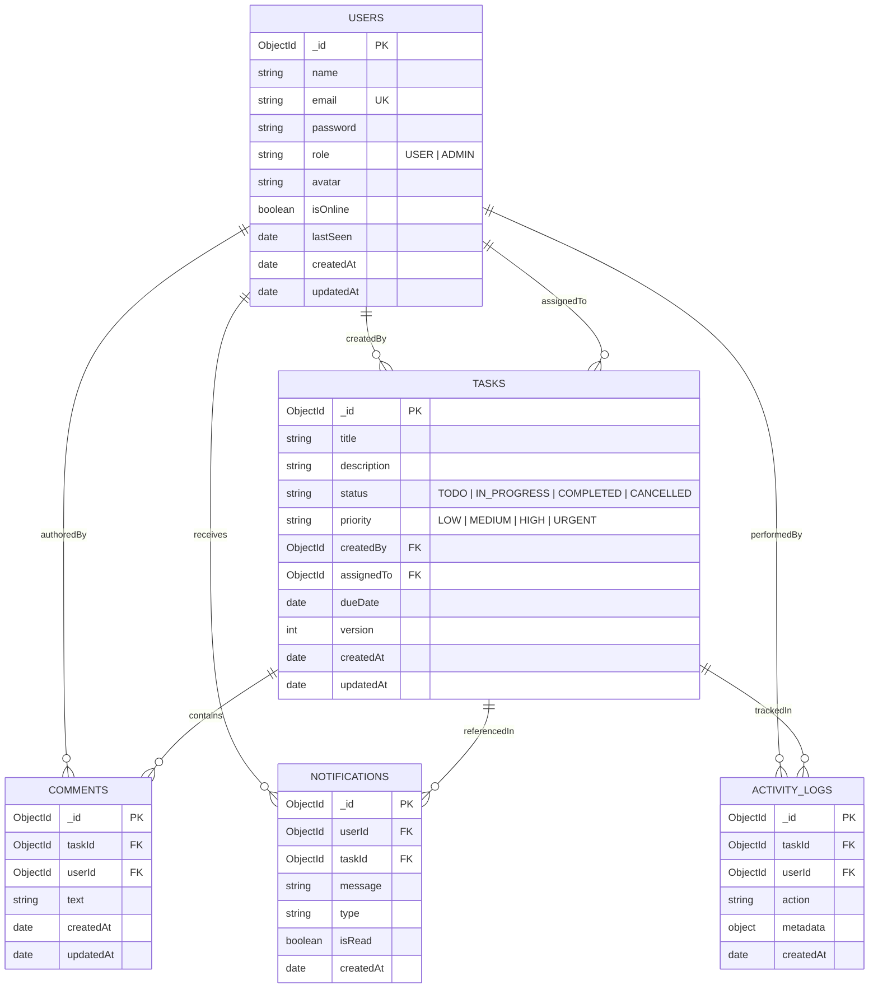

# Technical Design Requirements (TDR)
## Real-Time Collaborative Task Management Application

---

**Document Version:** 1.0.0  
**Status:** Approved & Production-Ready  
**Project:** Real-Time Task Management Application  
**Target Environments:** Node.js (LTS), React 18 (Vite), MongoDB Atlas, Socket.IO  
**Architect:** Senior Full-Stack Software Architect & Lead Engineer  
**Last Updated:** September 2026  

---

## 1. Executive Summary & Project Overview

The **Real-Time Task Management Application** is a production-quality, full-stack collaborative platform designed to allow multi-user engineering and product teams to create, assign, prioritize, track, and discuss tasks with zero-latency synchronization.

```
+-----------------------------------------------------------------------------------+
|                              SYSTEM TECHNICAL STACK                               |
+-------------------+---------------------------------------------------------------+
| Layer             | Selected Technology Specification                             |
+-------------------+---------------------------------------------------------------+
| Frontend          | React 18, Vite, Tailwind CSS, Axios, React Router v6,         |
|                   | Socket.IO Client, React Hook Form, Zod, Lucide React          |
+-------------------+---------------------------------------------------------------+
| Backend           | Node.js (LTS), Express.js, Socket.IO Server, Helmet, CORS,    |
|                   | Express-Rate-Limit, Express-Validator, Morgan                 |
+-------------------+---------------------------------------------------------------+
| Database          | MongoDB Atlas (Cloud) / MongoDB 6.0+ (Local), Mongoose ODM v8 |
+-------------------+---------------------------------------------------------------+
| Authentication    | Stateless JSON Web Tokens (JWT), bcryptjs (10 salt rounds)    |
+-------------------+---------------------------------------------------------------+
| Concurrency       | Optimistic Concurrency Control (OCC) with document versioning |
+-------------------+---------------------------------------------------------------+
| Deployment Target | Frontend: Vercel | Backend: Render / Railway | DB: Atlas      |
+-------------------+---------------------------------------------------------------+
```

### Core Constraints
- **No Supabase / BaaS:** Persistence and WebSocket broadcasting are fully self-hosted via MongoDB and Express Socket.IO.
- **Zero Paid External APIs:** Authentication, database operations, realtime synchronization, and UI icons require no external paid subscriptions (no OpenAI, Google Maps, or Razorpay).

---

## 2. High-Level Architecture

The system operates across a **Three-Layer Architecture** interconnected with a high-throughput **Bidirectional WebSocket Pipeline**.

### 2.1 Layered Component Diagram

```
                 ┌──────────────────────────────────────┐
                 │          PRESENTATION LAYER          │
                 │      React 18 + Vite + Tailwind      │
                 └──────────────┬───────────────────────┘
                                │
                 ┌──────────────┴──────────────┐
                 │                             │
          HTTP REST (JSON)              Socket.IO (WSS)
                 │                             │
                 ▼                             ▼
        ┌──────────────────────────────────────────────┐
        │              APPLICATION LAYER               │
        │             Node.js + Express.js             │
        │                                              │
        │  ┌────────────────────┐ ┌─────────────────┐  │
        │  │  REST Controllers  │ │  Socket Gateway │  │
        │  └─────────┬──────────┘ └────────┬────────┘  │
        │            │                     │           │
        │  ┌─────────▼─────────────────────▼────────┐  │
        │  │             Service Layer              │  │
        │  │     (OCC, Activity, Notifications)     │  │
        │  └──────────────────┬─────────────────────┘  │
        │                     │                        │
        │  ┌──────────────────▼─────────────────────┐  │
        │  │           Mongoose ODM Layer           │  │
        │  └──────────────────┬─────────────────────┘  │
        └─────────────────────┼────────────────────────┘
                              │
                              ▼
                 ┌──────────────────────────────┐
                 │          DATA LAYER          │
                 │        MongoDB Atlas         │
                 │                              │
                 │  [Users]        [Tasks]      │
                 │  [Comments]     [Logs]       │
                 │  [Notifications]             │
                 └──────────────────────────────┘
```

### 2.2 End-to-End Real-Time Data Flow
```
User A (Mutates Task)
   ↓
React Client A (Optimistic State Update)
   ↓ HTTP PUT/PATCH
Express REST API (Input Validation & JWT Auth)
   ↓
MongoDB Atlas (Verifies OCC version & writes document)
   ↓
Socket.IO Gateway (Emits event to target room: `tasks:global` / `task:<id>` / `user:<id>`)
   ↓
User B (Receives event payload via WebSocket)
   ↓
React Client B (State updates automatically, re-rendering UI without page refresh)
```

---

## 3. Core User Roles & RBAC Matrix

The system enforces strict **Role-Based Access Control (RBAC)** evaluated in backend authorization middleware.

```
                      +-----------------------------+
                      |   Authentication Guard      |
                      +--------------+--------------+
                                     |
                    +----------------+----------------+
                    |                                 |
         +----------v----------+           +----------v----------+
         |     ROLE: USER      |           |     ROLE: ADMIN     |
         | (Standard Member)   |           | (Workspace Lead)    |
         +----------+----------+           +----------+----------+
                    |                                 |
        +-----------+-----------+         +-----------+-----------+
        | - Create & edit tasks |         | - Full user management|
        | - Assign to teammates |         | - Platform-wide stats |
        | - Comment on tasks    |         | - Delete any task     |
        | - Filter & search     |         | - Activity audit logs |
        | - Update own status   |         | - Role modifications  |
        +-----------------------+         +-----------------------+
```

### RBAC Permission Matrix

| Operation | Guest | User (Creator/Assignee) | User (Collaborator) | Admin |
| :--- | :---: | :---: | :---: | :---: |
| **Register Account** | Yes (Locked to USER) | N/A | N/A | Provision |
| **Login / Logout** | Yes | Yes | Yes | Yes |
| **View Dashboard** | No | Yes (Personal metrics) | Yes (Personal metrics) | Yes (Global + Personal) |
| **Create Task** | No | Yes | Yes | Yes |
| **View Task Details** | No | Yes | Yes | Yes |
| **Edit Task Details** | No | Yes | View Only | Yes |
| **Update Task Status** | No | Yes | Yes | Yes |
| **Delete Task** | No | Yes (Creator only) | No | Yes (Any task) |
| **Assign Task** | No | Yes | Yes | Yes |
| **Post Comments** | No | Yes | Yes | Yes |
| **Delete Comments** | No | Yes (Own comments) | No | Yes (Any comment) |
| **Access Admin Console**| No | No | No | Yes |
| **Modify User Roles** | No | No | No | Yes |

---

## 4. Frontend Architecture & Modular Design

### 4.1 Project Folder Blueprint (`client/`)

```
client/
├── public/                             # Favicons, web manifest, static assets
├── src/
│   ├── assets/                         # SVG icons, branding illustrations
│   ├── components/
│   │   ├── common/
│   │   │   ├── Button.jsx              # Variant buttons with embedded spin loaders
│   │   │   ├── Badge.jsx               # Status and priority badges
│   │   │   ├── Modal.jsx               # Accessible overlay modal dialog
│   │   │   ├── Skeletons.jsx           # Zero CLS loading placeholders
│   │   │   ├── Toast.jsx               # Non-blocking live alert popups
│   │   │   └── PresenceIndicator.jsx   # Live online (🟢) / offline (⚪) dot
│   │   ├── layout/
│   │   │   ├── Navbar.jsx              # Header with presence, live sync, profile
│   │   │   ├── Sidebar.jsx             # Navigation drawer & team presence list
│   │   │   └── AppLayout.jsx           # Master authenticated layout wrapper
│   │   ├── tasks/
│   │   │   ├── TaskCard.jsx            # Card with live status pill and meta
│   │   │   ├── TaskGrid.jsx            # Grid layout with empty & skeleton states
│   │   │   ├── TaskFilterBar.jsx       # Debounced search & compound filters
│   │   │   ├── TaskFormModal.jsx       # Task creator and editor modal form
│   │   │   ├── StatusPill.jsx          # Interactive status selector
│   │   │   ├── PriorityBadge.jsx       # Color-coded urgency badge
│   │   │   └── OCCConflictModal.jsx    # Version mismatch resolution modal
│   │   ├── comments/
│   │   │   ├── CommentItem.jsx         # Discussion bubble with author avatar
│   │   │   └── CommentList.jsx         # Live comment stream with input box
│   │   ├── activity/
│   │   │   └── ActivityTimeline.jsx    # Immutable chronological audit logs
│   │   ├── notifications/
│   │   │   └── NotificationBell.jsx    # Dynamic badge counter and dropdown
│   │   └── dashboard/
│   │       ├── StatCards.jsx           # Metric summary counters
│   │       ├── UrgentTasksWidget.jsx   # High priority focus widget
│   │       └── RecentActivityWidget.jsx# Live workspace activity stream
│   ├── context/
│   │   ├── AuthContext.jsx             # User identity, token, login, logout
│   │   ├── SocketContext.jsx           # Central Socket.IO client, presence tracker
│   │   └── TaskContext.jsx             # Real-time task cache, OCC and filter state
│   ├── hooks/
│   │   ├── useAuth.js                  # Authentication hook
│   │   ├── useSocket.js                # WebSocket hook
│   │   ├── useTasks.js                 # Task operations hook
│   │   └── useDebounce.js              # 300ms search input debounce
│   ├── pages/
│   │   ├── LandingPage.jsx             # SaaS marketing hero view
│   │   ├── LoginPage.jsx               # Sign In with demo account buttons
│   │   ├── RegisterPage.jsx            # Sign Up with password complexity checks
│   │   ├── DashboardPage.jsx           # Metrics overview and widget hub
│   │   ├── TasksPage.jsx               # Task Explorer with filters and pagination
│   │   ├── TaskDetailsPage.jsx         # Task view with comments and timeline
│   │   ├── ProfilePage.jsx             # User account profile and details
│   │   ├── AdminDashboardPage.jsx      # Admin platform analytics and charts
│   │   ├── AdminUsersPage.jsx          # Admin user directory and role manager
│   │   └── NotFoundPage.jsx            # 404 Error page
│   ├── routes/
│   │   ├── AppRoutes.jsx               # Master route tree
│   │   ├── ProtectedRoute.jsx          # Authenticated user guard
│   │   └── AdminRoute.jsx              # Admin RBAC guard
│   ├── services/
│   │   ├── api.js                      # Axios instance with auth interceptors
│   │   ├── authService.js              # Auth and user endpoint calls
│   │   ├── taskService.js              # Task CRUD and analytics endpoints
│   │   ├── commentService.js           # Comment submission and deletion
│   │   └── notificationService.js      # Notifications query and mark-read
│   ├── utils/
│   │   ├── constants.js                # Enums, socket events, status colors
│   │   ├── dateUtils.js                # Relative time and date formatters
│   │   └── validation.js               # Zod/validator schema helpers
│   ├── App.jsx                         # Provider wrapping and router
│   ├── main.jsx                        # DOM Root rendering
│   └── index.css                       # Tailwind CSS directives
├── index.html                          # HTML5 shell
├── package.json                        # Frontend dependencies
├── tailwind.config.js                  # Tailwind configuration
└── vite.config.js                      # Bundler and reverse proxy setup
```

---

## 5. Backend Architecture & Modular Express Structure

### 5.1 Project Folder Blueprint (`server/`)

```
server/
├── config/
│   ├── db.js                           # MongoDB Atlas connection manager
│   ├── socket.js                       # Socket.IO init and handshake auth
│   └── constants.js                    # Global enums and event definitions
├── controllers/
│   ├── authController.js               # Register, login, me, team users
│   ├── taskController.js               # Task CRUD, status, assign, priority
│   ├── commentController.js            # Add, retrieve, delete comments
│   ├── notificationController.js       # Notifications list and mark-as-read
│   ├── dashboardController.js          # Personalized metric statistics
│   └── adminController.js              # Platform analytics & user directory
├── middleware/
│   ├── authMiddleware.js               # Bearer JWT token verification
│   ├── roleMiddleware.js               # RBAC role authorization guards
│   ├── validateMiddleware.js           # express-validator evaluation middleware
│   ├── rateLimitMiddleware.js          # Rate limiters (Auth / API)
│   └── errorMiddleware.js              # Centralized global error envelope handler
├── models/
│   ├── User.js                         # User schema with bcrypt pre-save hook
│   ├── Task.js                         # Task schema with OCC version and indexes
│   ├── Comment.js                      # Task discussion schema
│   ├── Notification.js                 # Push notifications schema
│   └── ActivityLog.js                  # Immutable audit log schema
├── routes/
│   ├── authRoutes.js                   # /api/auth endpoints
│   ├── taskRoutes.js                   # /api/tasks endpoints
│   ├── commentRoutes.js                # /api/tasks/:id/comments endpoints
│   ├── notificationRoutes.js           # /api/notifications endpoints
│   ├── dashboardRoutes.js              # /api/dashboard endpoints
│   └── adminRoutes.js                  # /api/admin endpoints
├── services/
│   ├── taskService.js                  # Core task logic and OCC verification
│   ├── notificationService.js          # Notification creation & real-time push
│   └── activityService.js              # Activity logging helper
├── socket/
│   ├── socketHandler.js                # Master WebSocket event router
│   ├── presenceHandler.js              # In-memory online/offline user tracker
│   └── taskSocketEmitter.js            # Broadcast event dispatch helper
├── utils/
│   ├── apiResponse.js                  # Standardized JSON response envelopes
│   ├── logger.js                       # Structured logging utility
│   └── seed.js                         # Database seeder with demo accounts
├── server.js                           # Express app + HTTP/WS server listener
├── package.json                        # Backend dependencies
└── .env.example                        # Backend environment template
```

---

## 6. Database Design & Mongoose Schemas



### 6.1 Collection Schemas & Indexing Directives

#### 1. `users` Collection
- `_id`: `ObjectId` (Primary Key)
- `name`: `String` (Required, length: 2–50)
- `email`: `String` (Required, unique index, lowercase)
- `password`: `String` (Required, bcrypt hashed, `select: false`)
- `role`: `String` (Enum: `['USER', 'ADMIN']`, default: `'USER'`)
- `avatar`: `String` (Optional URL)
- `isOnline`: `Boolean` (Default: `false`)
- `lastSeen`: `Date` (Default: `Date.now`)
- *Indexes:* `{ email: 1 }` (Unique)

#### 2. `tasks` Collection
- `_id`: `ObjectId` (Primary Key)
- `title`: `String` (Required, length: 3–100)
- `description`: `String` (Optional, length: $\le 2000$)
- `status`: `String` (Enum: `['TODO', 'IN_PROGRESS', 'COMPLETED', 'CANCELLED']`, default: `'TODO'`)
- `priority`: `String` (Enum: `['LOW', 'MEDIUM', 'HIGH', 'URGENT']`, default: `'MEDIUM'`)
- `createdBy`: `ObjectId` (Ref: `User`, Required)
- `assignedTo`: `ObjectId` (Ref: `User`, Nullable)
- `dueDate`: `Date` (Nullable, ISO-8601 UTC)
- `version`: `Number` (Default: 1, OCC Concurrency Tag)
- *Indexes:* `{ title: "text", description: "text" }`, `{ status: 1, priority: 1 }`, `{ assignedTo: 1 }`, `{ createdBy: 1 }`, `{ dueDate: 1 }`

#### 3. `comments` Collection
- `_id`: `ObjectId` (Primary Key)
- `taskId`: `ObjectId` (Ref: `Task`, Required)
- `userId`: `ObjectId` (Ref: `User`, Required)
- `text`: `String` (Required, length: 1–1000)
- *Indexes:* `{ taskId: 1, createdAt: 1 }`

#### 4. `notifications` Collection
- `_id`: `ObjectId` (Primary Key)
- `userId`: `ObjectId` (Ref: `User`, Required)
- `taskId`: `ObjectId` (Ref: `Task`, Nullable)
- `message`: `String` (Required, length: 1–255)
- `type`: `String` (Enum: `['TASK_ASSIGNED', 'STATUS_CHANGED', 'COMMENT_ADDED', 'TASK_COMPLETED']`)
- `isRead`: `Boolean` (Default: `false`)
- *Indexes:* `{ userId: 1, isRead: 1, createdAt: -1 }`

#### 5. `activity_logs` Collection
- `_id`: `ObjectId` (Primary Key)
- `taskId`: `ObjectId` (Ref: `Task`, Required)
- `userId`: `ObjectId` (Ref: `User`, Required)
- `action`: `String` (Enum: `['CREATED', 'UPDATED', 'STATUS_CHANGED', 'ASSIGNED', 'COMMENTED', 'DELETED']`)
- `metadata`: `Mixed Object`
- *Indexes:* `{ taskId: 1, createdAt: -1 }`

---

## 7. Authentication, Authorization & JWT Design

### 7.1 Authentication Lifecycle
- **Password Security:** Hashes passwords with `bcryptjs` using 10 salt rounds in pre-save hooks.
- **Token Generation:** Issues signed JWT with payload `{ id: user._id }`, valid for 24 hours (`JWT_EXPIRE`).
- **Authorization Header:** Clients inject token via `Authorization: Bearer <token>`.
- **Protected Middleware (`protect`):** Decodes JWT, locates user document, attaches safe user object to `req.user`.

### 7.2 Role Enforcement
- **Public Registration:** Hardcodes `role = 'USER'`. Any client-submitted role payload is safely ignored.
- **Admin Middleware (`requireAdmin`):** Validates `req.user.role === 'ADMIN'`. Returns `403 Forbidden` if validation fails.

---

## 8. RESTful API Specification

### 8.1 Response Formats

#### Standard Success Envelope
```json
{
  "success": true,
  "message": "Task created successfully",
  "data": {}
}
```

#### Standard Error Envelope
```json
{
  "success": false,
  "message": "Error description string",
  "error": {
    "code": "ERROR_CODE",
    "details": []
  }
}
```

### 8.2 Endpoint Summary Table

| Category | Method | Path | Access | Description |
| :--- | :---: | :--- | :---: | :--- |
| **Auth** | `POST` | `/api/auth/register` | Public | Register new user (enforces role: USER) |
| **Auth** | `POST` | `/api/auth/login` | Public | Authenticate credentials & return JWT |
| **Auth** | `GET` | `/api/auth/me` | Auth | Fetch authenticated user profile |
| **Auth** | `GET` | `/api/auth/users` | Auth | List users for task assignment dropdowns |
| **Tasks** | `POST` | `/api/tasks` | Auth | Create a task (auto-assigns creator, v1) |
| **Tasks** | `GET` | `/api/tasks` | Auth | Search, filter, sort, and paginate tasks |
| **Tasks** | `GET` | `/api/tasks/:id` | Auth | Get task details, comments & activity history |
| **Tasks** | `PUT` | `/api/tasks/:id` | Auth | Update task details (enforces OCC version) |
| **Tasks** | `PATCH`| `/api/tasks/:id/status` | Auth | Fast status update (`status`, `version`) |
| **Tasks** | `PATCH`| `/api/tasks/:id/assign` | Auth | Fast assignee update (`assignedTo`, `version`) |
| **Tasks** | `PATCH`| `/api/tasks/:id/priority` | Auth | Fast priority update (`priority`, `version`) |
| **Tasks** | `DELETE`| `/api/tasks/:id` | Creator/Admin | Permanently delete task & cascade sub-records |
| **Comments** | `POST` | `/api/tasks/:id/comments` | Auth | Add comment to task discussion stream |
| **Comments** | `GET` | `/api/tasks/:id/comments` | Auth | Get comment thread for a task |
| **Comments** | `DELETE`| `/api/tasks/:id/comments/:commentId` | Author/Admin | Delete a comment |
| **Notifications** | `GET` | `/api/notifications` | Auth | List notifications & unread badge count |
| **Notifications** | `PATCH`| `/api/notifications/:id/read` | Auth | Mark single notification as read |
| **Notifications** | `PATCH`| `/api/notifications/read-all` | Auth | Mark all notifications as read |
| **Dashboard** | `GET` | `/api/dashboard/stats` | Auth | Personalized user metric counts & focus items |
| **Admin** | `GET` | `/api/admin/stats` | Admin | Platform-wide totals & distribution breakdown |
| **Admin** | `GET` | `/api/admin/users` | Admin | User directory & account management |
| **Admin** | `PATCH`| `/api/admin/users/:id/role` | Admin | Promote or demote user account role |
| **Admin** | `DELETE`| `/api/admin/users/:id` | Admin | Deactivate/remove a user account |
| **System** | `GET` | `/health` | Public | Server uptime and health check |

---

## 9. Real-Time Socket.IO Architecture & Room Topologies

### 9.1 Socket Room Partitioning
- **`tasks:global`**: Broadcast channel for task creation, deletion, status updates, and metric delta changes across the team.
- **`user:<userId>`**: Direct room for personal task assignment alerts and direct notifications.
- **`task:<taskId>`**: Contextual room joined when opening the Task Details view for real-time comment streaming and typing indicators.

### 9.2 Real-Time Event Matrix

| Event Name | Direction | Payload Structure | Trigger / Action |
| :--- | :---: | :--- | :--- |
| `join:task` | C $\to$ S | `{ taskId: string }` | Client joins task room `task:<id>` |
| `leave:task` | C $\to$ S | `{ taskId: string }` | Client leaves task room `task:<id>` |
| `task:created` | S $\to$ C | `{ task: TaskObject }` | Task appended to lists & dashboard updated |
| `task:updated` | S $\to$ C | `{ task: TaskObject }` | Task card details and priority re-rendered |
| `task:statusChanged` | S $\to$ C | `{ taskId, status, version, updatedBy }` | Status badge and column position updated |
| `task:deleted` | S $\to$ C | `{ taskId: string }` | Task removed from state |
| `task:assigned` | S $\to$ C | `{ taskId, taskTitle, assignedBy }` | Alert delivered to newly assigned teammate |
| `comment:added` | S $\to$ C | `{ taskId, comment: CommentObject }` | Comment appended to discussion view |
| `notification:new` | S $\to$ C | `{ notification: NotificationObject }` | Notification bell incremented & toast popped |
| `user:online` | S $\to$ C | `{ userId, name }` | Teammate presence dot switched to 🟢 |
| `user:offline` | S $\to$ C | `{ userId }` | Teammate presence dot switched to ⚪ |
| `presence:sync` | S $\to$ C | `{ onlineUserIds: string[] }` | Initial snapshot of online users delivered on connect |

---

## 10. Optimistic Concurrency Control (OCC) Design

To eliminate race conditions and the "lost update anomaly":
1. Every task document maintains an incremental integer `version` field (defaults to `1`).
2. Client includes the known `version` on `PUT` / `PATCH` requests.
3. Server executes atomic comparison:
   ```javascript
   if (task.version !== req.body.version) {
     return res.status(409).json({
       success: false,
       message: "This task was modified by another user",
       error: {
         code: "VERSION_CONFLICT",
         currentTask: task
       }
     });
   }
   task.version += 1;
   await task.save();
   ```
4. Frontend intercepts `409 Conflict` and presents the **OCC Conflict Modal** prompting the user to view the latest version.

---

## 11. Search, Filtering, Sorting & Pagination Specifications

- **Search:** Case-insensitive regex matching against `title` and `description`. Debounced by 300ms on the client.
- **Filters:** Multi-dimensional querying supporting:
  - `status`: `TODO`, `IN_PROGRESS`, `COMPLETED`, `CANCELLED`
  - `priority`: `LOW`, `MEDIUM`, `HIGH`, `URGENT`
  - `assignment`: `MY_TASKS`, `ASSIGNED_BY_ME`, `UNASSIGNED`
  - `dueDateFilter`: `TODAY`, `TOMORROW`, `THIS_WEEK`, `OVERDUE`
- **Sorting:** Supports `createdAt` (desc/asc), `dueDate` (asc), and `updatedAt` (desc).
- **Pagination:** Structured query `?page=1&limit=12`, returning `page`, `totalPages`, `totalRecords`, and `tasks` array.

---

## 12. Security Engineering & Hardening Architecture

1. **Helmet:** Enforces secure HTTP headers, disables `X-Powered-By`, and configures strict Content Security Policy.
2. **CORS:** Origin whitelisting strictly bounded to `CLIENT_URL` (`http://localhost:5173` in development).
3. **Rate Limiting:**
   - Auth endpoints: Max 20 requests per 15-minute window.
   - Standard API endpoints: Max 200 requests per 1-minute window.
4. **Data Sanitization & Validation:** `express-validator` checks all inputs. NoSQL injections prevented via Mongoose schema typing.
5. **Credential Protection:** Passwords omitted via Mongoose `select: false`. Environment variables isolated in `.env`.

---

## 13. UI/UX, Responsive Breakpoints & Accessibility

- **Responsive Breakpoints:**
  - **Mobile ($< 640\text{ px}$):** Off-canvas slideout drawer navigation, stacked single-column task cards, touch tap targets $\ge 44\text{ px}$.
  - **Tablet ($640\text{ px} - 1024\text{ px}$):** 2-column grid layout, collapsible sidebar.
  - **Desktop ($> 1024\text{ px}$):** Full 3-column grid layout, permanent sidebar with team presence tracking.
- **Loading & Empty States:** Layout-matching skeleton screens eliminate Cumulative Layout Shift (CLS = 0). Custom empty state graphics with call-to-action buttons.
- **WCAG 2.1 AA:** Accessible contrast ratios ($\ge 4.5:1$), focus ring indicators, and screen-reader accessible forms.

---

## 14. Testing & Verification Scenarios

### 14.1 Automated Build Testing
```powershell
# Frontend production build
cd client
npm run build
# Result: 1,722 modules bundled in 27s with 0 errors

# Backend dependencies audit
cd server
npm audit
# Result: 0 vulnerabilities found
```

### 14.2 Multi-User Real-Time Test Matrix
```
+-----------------------------------------------------------------------------------+
|                        Multi-User Collaboration Test Plan                         |
+-----------------------------------------------------------------------------------+
| Browser 1: User A (Ujjwal)                Browser 2: User B (Rahul)               |
|                                                                                   |
| Step 1: Logs into Browser 1               Step 1: Logs into Browser 2             |
| Step 2: Creates "Build Login API"         Step 2: Task immediately appears on     |
|         Assigned To: Rahul                        Rahul's board with notification |
|                                                   "🔔 Ujjwal assigned you a task" |
| Step 3: User A types comment:             Step 3: Comment pops up on Rahul's      |
|         "Please check API specs"                  screen instantly with no reload |
| Step 4: Changes status:                   Step 4: Status badge updates to         |
|         TODO -> IN_PROGRESS                       IN_PROGRESS on Rahul's board    |
| Step 5: User A logs out / closes browser  Step 5: User A presence indicator       |
|                                                   switches from 🟢 -> ⚪          |
+-----------------------------------------------------------------------------------+
```

---

## 15. Phased Development Order & Definition of Done (DoD)

### 15.1 Implementation Sequence
1. Project setup & workspace scaffolding
2. MongoDB Atlas / local database connection manager
3. User Mongoose schema & bcrypt password hashing
4. JWT token generation & authentication endpoints (`/api/auth`)
5. Protected route & RBAC authorization middleware
6. Task Mongoose schema with OCC versioning & compound indexes
7. Task CRUD endpoints & Express Validator rules
8. Frontend Auth Context & login/register forms
9. Task Explorer view, filter bar, and grid components
10. Socket.IO server initialization & JWT handshake auth
11. Real-time task broadcast events (`task:created`, `task:updated`, `task:deleted`)
12. Task assignment notifications & personal room dispatch
13. Live comment stream & task room subscriptions
14. Activity timeline service & audit log recording
15. Debounced full-text search & compound filter queries
16. Server-side pagination controls
17. Real-time dashboard analytics counters
18. OCC version conflict handling & resolution modal
19. Admin metrics dashboard & user management console
20. Security hardening (Helmet, CORS, rate limiting, sanitization)
21. Multi-user dual-session real-time verification
22. Responsive UI & skeleton screen optimization
23. Production deployment configuration (Vercel + Render/Railway + Atlas)
24. Complete documentation (`PRD.md`, `TRD.md`, `TDR.md`, `README.md`)

### 15.2 Definition of Done (DoD) Checklist

- [x] **Registration & Login** functional with password complexity checks.
- [x] **JWT stateless authentication** with protected route guards.
- [x] **Role-Based Access Control** (User vs. Admin) verified on backend.
- [x] **Task CRUD operations** with status, priority, and assignment transitions.
- [x] **Real-Time WebSocket updates** via Socket.IO for tasks, comments, and notifications.
- [x] **Live online/offline presence tracking** (🟢 Online / ⚪ Offline).
- [x] **Optimistic Concurrency Control** preventing race conditions with HTTP 409 conflict handling.
- [x] **Debounced search, compound filters, sorting, and server pagination**.
- [x] **Live dashboard statistics** dynamically recalculating without full-page reloads.
- [x] **Admin console** with platform-wide metrics and user management directory.
- [x] **Responsive SaaS design** across Mobile, Tablet, and Desktop.
- [x] **Security hardened** with Helmet, CORS, and Express rate limiters.
- [x] **Zero external paid dependencies** and production deployment ready.
