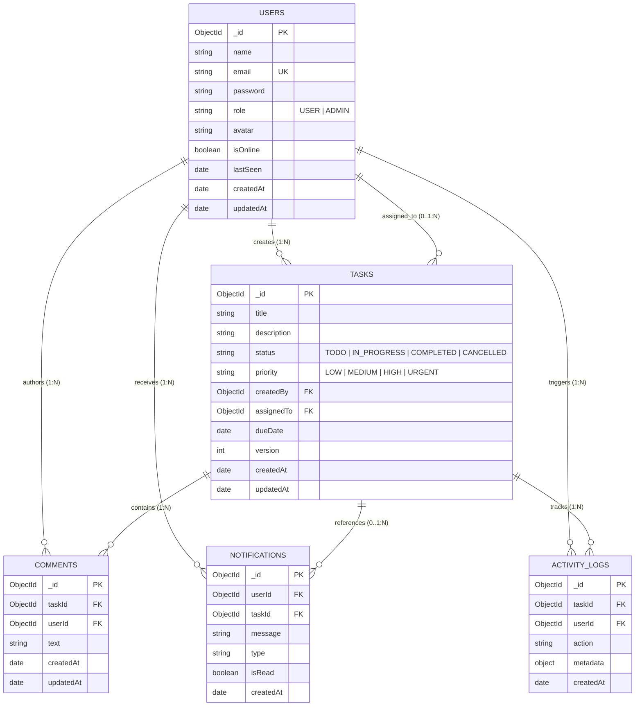
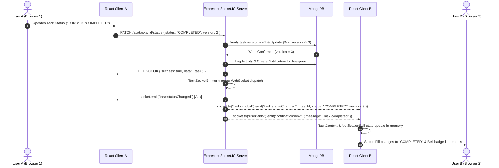

# Technical Requirements Document (TRD)
## Real-Time Task Management Application

---

**Document Version:** 1.0.0  
**Status:** Approved & Implemented  
**Target Environment:** Node.js (LTS), React 18 (Vite), MongoDB (Atlas / Community), Socket.IO  
**Architecture Pattern:** Decoupled 3-Tier Layered Architecture with Service/Repository Pattern & WebSocket Gateway  
**Author:** Senior Full-Stack Software Architect & Technical Lead  
**Last Updated:** September 2026  

---

## 1. Executive Engineering Summary

The **Real-Time Task Management Application** is a production-grade, multi-user collaborative platform designed for low-latency task lifecycle tracking, live team communications, and granular administrative oversight.

### 1.1 Technical Stack Overview

```
+-----------------------------------------------------------------------------------+
|                                 TECHNOLOGY STACK                                  |
+-------------------+---------------------------------------------------------------+
| Layer             | Selected Technologies                                         |
+-------------------+---------------------------------------------------------------+
| Frontend          | React 18, Vite, Tailwind CSS, Axios, React Router v6,         |
|                   | Socket.IO Client, Lucide React                                |
+-------------------+---------------------------------------------------------------+
| Backend           | Node.js, Express.js, Socket.IO Server, Helmet, CORS,          |
|                   | Express-Rate-Limit, Express-Validator, Morgan                 |
+-------------------+---------------------------------------------------------------+
| Persistence       | MongoDB (Community 6.0+ / Atlas M0), Mongoose ODM v8          |
+-------------------+---------------------------------------------------------------+
| Security & IAM    | JWT (JSON Web Tokens), bcryptjs (Salt rounds: 10)             |
+-------------------+---------------------------------------------------------------+
| Real-Time Engine  | Socket.IO (WebSocket protocol with HTTP polling fallback)     |
+-------------------+---------------------------------------------------------------+
| Hosting Platforms | Frontend: Vercel | Backend: Render / Railway | DB: Atlas      |
+-------------------+---------------------------------------------------------------+
```

### 1.2 Mandatory Architectural Constraints
1. **Zero External Paid Dependencies:** No third-party proprietary APIs (OpenAI, Google Maps, Twilio, Razorpay) are utilized.
2. **No Supabase / External BaaS:** Persistence and real-time streaming are self-hosted via MongoDB and Express Socket.IO.
3. **Optimistic Concurrency Control (OCC):** Strict versioning (`version` integer) prevents silent overwrite anomalies during concurrent updates.
4. **Stateless Scalability:** REST endpoints and WebSocket handshakes authenticate via cryptographic JWT bearer tokens.

---

## 2. System Architecture & Component Topology

The system implements a classic **Three-Tier Architecture** coupled with an asynchronous **Event-Driven WebSocket Gateway**.

```
                           +------------------------------------------+
                           |           PRESENTATION LAYER             |
                           |       React 18 + Vite SPA Client         |
                           +--------------------+---------------------+
                                                |
                       +------------------------+------------------------+
                       | HTTP REST (JSON)                                | WebSocket (WSS)
                       | [Axios Client]                                  | [Socket.IO Client]
                       v                                                 v
+-----------------------------------------------------------------------------------+
|                              APPLICATION / API LAYER                              |
|                              (Node.js + Express.js)                               |
|                                                                                   |
|  +-----------------------------------------------------------------------------+  |
|  | Security Pipeline: Helmet | CORS | Rate-Limiter | Body-Parser | Auth Guard  |  |
|  +-----------------------------------------------------------------------------+  |
|                                       |                                           |
|         +-----------------------------+-----------------------------+             |
|         |                                                           |             |
|  +------v-----------------------------+              +--------------v----------+  |
|  |     REST API Controllers           |              |    Socket.IO Gateway    |  |
|  | (Auth, Tasks, Comments, Dash, Adm) |              | (Rooms, Presence, Delta)|  |
|  +--------------------+---------------+              +--------------+----------+  |
|                       |                                             |             |
|         +-------------v---------------------------------------------v----------+  |
|         |                           Service Layer                              |  |
|         |      (Domain Logic, OCC Verification, Activity Logs, Notifications)  |  |
|         +-------------------------------------+--------------------------------+  |
|                                               |                                   |
|         +-------------------------------------v--------------------------------+  |
|         |                     Data Access / Mongoose ODM                       |  |
|         +-------------------------------------+--------------------------------+  |
+-----------------------------------------------|-----------------------------------+
                                                | TCP / Wire Protocol
+-----------------------------------------------v-----------------------------------+
|                                  DATA LAYER                                       |
|                       MongoDB Database (Collections & Indexes)                    |
|                                                                                   |
|   [Users]       [Tasks]       [Comments]       [Notifications]   [ActivityLogs]   |
+-----------------------------------------------------------------------------------+
```

---

## 3. Database Architecture & Data Modeling

### 3.1 Relational Invariant Model



### 3.2 Schema Definitions & Indexing Specifications

#### 1. Collection: `users`
- **Fields:**
  - `_id`: `ObjectId` (Primary Key)
  - `name`: `String` (Required, trim, length: 2–50)
  - `email`: `String` (Required, unique, lowercase, regex-validated)
  - `password`: `String` (Required, min 8 chars, hashed with bcrypt, `select: false`)
  - `role`: `String` (Enum: `['USER', 'ADMIN']`, default: `'USER'`)
  - `avatar`: `String` (Optional, URL placeholder)
  - `isOnline`: `Boolean` (Default: `false`)
  - `lastSeen`: `Date` (Default: `Date.now`)
  - `createdAt`, `updatedAt`: `Date` (Managed via `timestamps: true`)
- **Indexes:**
  - `{ email: 1 }` (Unique compound index)

#### 2. Collection: `tasks`
- **Fields:**
  - `_id`: `ObjectId` (Primary Key)
  - `title`: `String` (Required, trim, length: 3–150)
  - `description`: `String` (Optional, max length: 5000)
  - `status`: `String` (Enum: `['TODO', 'IN_PROGRESS', 'COMPLETED', 'CANCELLED']`, default: `'TODO'`)
  - `priority`: `String` (Enum: `['LOW', 'MEDIUM', 'HIGH', 'URGENT']`, default: `'MEDIUM'`)
  - `createdBy`: `ObjectId` (Ref: `User`, Required)
  - `assignedTo`: `ObjectId` (Ref: `User`, Nullable)
  - `dueDate`: `Date` (Nullable, ISO-8601 UTC)
  - `version`: `Number` (Required, default: 1, incremental OCC tag)
  - `createdAt`, `updatedAt`: `Date` (Managed via `timestamps: true`)
- **Virtuals:**
  - `commentCount`: Local field `_id` ref `Comment.taskId` count.
- **Indexes:**
  - `{ title: "text", description: "text" }` (Full-text index)
  - `{ status: 1, priority: 1 }` (Compound filtering index)
  - `{ assignedTo: 1, status: 1 }` (Assignee query index)
  - `{ createdBy: 1, createdAt: -1 }` (Creator feed index)
  - `{ dueDate: 1 }` (Overdue & upcoming timeline index)

#### 3. Collection: `comments`
- **Fields:**
  - `_id`: `ObjectId` (Primary Key)
  - `taskId`: `ObjectId` (Ref: `Task`, Required)
  - `userId`: `ObjectId` (Ref: `User`, Required)
  - `text`: `String` (Required, trim, length: 1–1000)
  - `createdAt`, `updatedAt`: `Date` (Managed via `timestamps: true`)
- **Indexes:**
  - `{ taskId: 1, createdAt: 1 }` (Chronological discussion retrieval index)

#### 4. Collection: `notifications`
- **Fields:**
  - `_id`: `ObjectId` (Primary Key)
  - `userId`: `ObjectId` (Ref: `User`, Required, recipient)
  - `taskId`: `ObjectId` (Ref: `Task`, Nullable)
  - `message`: `String` (Required, length: 1–255)
  - `type`: `String` (Enum: `['TASK_ASSIGNED', 'STATUS_CHANGED', 'PRIORITY_CHANGED', 'COMMENT_ADDED', 'TASK_COMPLETED', 'TASK_DELETED']`)
  - `isRead`: `Boolean` (Default: `false`)
  - `createdAt`: `Date` (Default: `Date.now`)
- **Indexes:**
  - `{ userId: 1, isRead: 1, createdAt: -1 }` (Unread badge & feed query index)

#### 5. Collection: `activity_logs`
- **Fields:**
  - `_id`: `ObjectId` (Primary Key)
  - `taskId`: `ObjectId` (Ref: `Task`, Required)
  - `userId`: `ObjectId` (Ref: `User`, Required, actor)
  - `action`: `String` (Enum: `['CREATED', 'UPDATED', 'STATUS_CHANGED', 'PRIORITY_CHANGED', 'ASSIGNED', 'COMMENTED', 'DELETED']`)
  - `metadata`: `Mixed Object` (e.g., `{ from: 'TODO', to: 'IN_PROGRESS', version: 2 }`)
  - `createdAt`: `Date` (Default: `Date.now`)
- **Indexes:**
  - `{ taskId: 1, createdAt: -1 }` (Task history index)
  - `{ createdAt: -1 }` (Global activity stream index)

---

## 4. Authentication, Authorization & Identity Architecture

```
+-----------------------------------------------------------------------------------+
|                               IAM LIFECYCLE FLOW                                  |
+-----------------------------------------------------------------------------------+
|                                                                                   |
|  [Registration Flow]                                                              |
|  Client (name, email, password)                                                   |
|    --> Express Validator (Complexity check: >=8 chars, Upper, Lower, Number)      |
|    --> User.findOne({ email }) (Check duplication -> 409 Conflict)                |
|    --> bcryptjs.hash(password, 10) (Pre-save hook)                                |
|    --> User.create({ role: 'USER' }) (Public registration role hard-locked)       |
|    --> jwt.sign({ id: user._id }, JWT_SECRET, { expiresIn: '24h' })               |
|    --> Return 201 Created { success: true, data: { user, token } }                |
|                                                                                   |
|  [Login Flow]                                                                     |
|  Client (email, password)                                                         |
|    --> Express Validator (Syntactic format)                                       |
|    --> User.findOne({ email }).select('+password')                                |
|    --> bcryptjs.compare(password, user.password)                                  |
|        - Invalid -> 401 Unauthorized ("Invalid email or password")                |
|        - Valid   -> jwt.sign({ id: user._id }, JWT_SECRET)                       |
|    --> Return 200 OK { success: true, data: { user, token } }                     |
|                                                                                   |
|  [Request Authentication Middleware]                                              |
|  HTTP Headers -> Authorization: Bearer <token>                                    |
|    --> jwt.verify(token, JWT_SECRET)                                              |
|    --> User.findById(decoded.id).select('-password')                              |
|    --> Injects `req.user` into request lifecycle                                  |
|    --> Expired/Malformed -> 401 Unauthorized                                      |
|                                                                                   |
|  [Role-Based Authorization (RBAC) Middleware]                                     |
|  `requireAdmin` -> Evaluates `req.user.role === 'ADMIN'`                          |
|    - False -> 403 Forbidden ("Role is not authorized to access this resource")    |
|    - True  -> next()                                                              |
+-----------------------------------------------------------------------------------+
```

---

## 5. RESTful API Specification

### 5.1 Standard Response Envelopes

#### Success Envelope (`200 OK`, `201 Created`)
```json
{
  "success": true,
  "message": "Operation description string",
  "data": {}
}
```

#### Error Envelope (`400`, `401`, `403`, `404`, `409`, `422`, `429`, `500`)
```json
{
  "success": false,
  "message": "Human-readable error description",
  "error": {
    "code": "ERROR_CODE_STRING",
    "details": []
  }
}
```

### 5.2 Complete Route Catalog

| Module | Method | Endpoint | Access Level | Description |
| :--- | :---: | :--- | :---: | :--- |
| **Auth** | `POST` | `/api/auth/register` | Public | Register new user (role forced to `USER`) |
| **Auth** | `POST` | `/api/auth/login` | Public | Authenticate user & issue signed JWT |
| **Auth** | `GET` | `/api/auth/me` | Authenticated | Retrieve authenticated user profile |
| **Auth** | `GET` | `/api/auth/users` | Authenticated | List team users for task assignments |
| **Tasks** | `POST` | `/api/tasks` | Authenticated | Create a task (auto-sets `createdBy`, `version=1`) |
| **Tasks** | `GET` | `/api/tasks` | Authenticated | Query tasks (Search, Filter, Sort, Pagination) |
| **Tasks** | `GET` | `/api/tasks/:id` | Authenticated | Get task details, comments & activity history |
| **Tasks** | `PUT` | `/api/tasks/:id` | Creator/Assignee/Admin | Update task full details (OCC checked) |
| **Tasks** | `PATCH`| `/api/tasks/:id/status` | Authenticated | Fast status transition (`status`, `version`) |
| **Tasks** | `PATCH`| `/api/tasks/:id/assign` | Authenticated | Update task assignment (`assignedTo`, `version`) |
| **Tasks** | `PATCH`| `/api/tasks/:id/priority` | Authenticated | Update task priority (`priority`, `version`) |
| **Tasks** | `DELETE`| `/api/tasks/:id` | Creator/Admin | Permanently delete task & cascade records |
| **Comments**| `POST` | `/api/tasks/:id/comments` | Authenticated | Post comment to task discussion stream |
| **Comments**| `GET` | `/api/tasks/:id/comments` | Authenticated | Retrieve comment feed for a task |
| **Comments**| `DELETE`| `/api/tasks/:id/comments/:commentId` | Author/Admin | Delete a comment |
| **Notifications**| `GET` | `/api/notifications` | Authenticated | Fetch notifications list and unread count |
| **Notifications**| `PATCH`| `/api/notifications/:id/read` | Authenticated | Mark single notification as read |
| **Notifications**| `PATCH`| `/api/notifications/read-all` | Authenticated | Mark all notifications as read |
| **Dashboard** | `GET` | `/api/dashboard/stats` | Authenticated | Personalized task metrics & urgent items |
| **Admin** | `GET` | `/api/admin/stats` | Admin Only | Platform-wide totals & distribution maps |
| **Admin** | `GET` | `/api/admin/users` | Admin Only | User directory with presence states |
| **Admin** | `PATCH`| `/api/admin/users/:id/role` | Admin Only | Promote / Demote user role |
| **Admin** | `DELETE`| `/api/admin/users/:id` | Admin Only | Deactivate / remove user account |
| **System** | `GET` | `/health` | Public | Liveness probe (uptime, memory, timestamp) |

---

## 6. Real-Time WebSocket (Socket.IO) Architecture

### 6.1 Handshake Authentication & Security
1. Client establishes connection passing JWT in `auth: { token }`.
2. Socket middleware validates token:
   ```javascript
   io.use(async (socket, next) => {
     const token = socket.handshake.auth?.token;
     const decoded = jwt.verify(token, process.env.JWT_SECRET);
     socket.user = await User.findById(decoded.id).select('-password');
     next();
   });
   ```

### 6.2 Socket.IO Room Topology

| Room Identifier | Subscription Boundary | Dispatched Events |
| :--- | :--- | :--- |
| `tasks:global` | All connected workspace users | `task:created`, `task:statusChanged`, `task:deleted`, `task:updated` |
| `user:<userId>` | Specific user private channel | `notification:new`, `task:assigned` |
| `task:<taskId>` | Active viewers on Task Details view | `comment:added`, `user:typing`, granular task diffs |

### 6.3 Real-Time Sequence Diagram



### 6.4 Online/Offline Presence Engine
- **In-Memory Tracking:** `PresenceManager` maps `userId -> Set<socketId>`.
- **Connect:** When `Set.size === 1`, emits global `user:online` with `{ userId, name }`.
- **Disconnect:** When `Set.size === 0`, deletes key and emits global `user:offline` with `{ userId }`.
- **Sync:** On connection, newly connected client receives initial snapshot via `presence:sync`.

---

## 7. Optimistic Concurrency Control (OCC) Protocol

### 7.1 Problem Definition
In multi-user collaborative environments, concurrent edits by two users on the same task can cause destructive overwrites ("lost update anomaly").

### 7.2 Concurrency Control Workflow

```
Client A (Version: 2)                   Client B (Version: 2)
      |                                       |
      |-- 1. Submits Edit (version: 2) ------->|
      |   (Arrives at Server First)           |
      |   DB matches (2 == 2) -> OK           |
      |   DB updates & increments to v3       |
      |                                       |
      |                                       |-- 2. Submits Edit (version: 2)
      |                                       |   (Arrives at Server Second)
      |                                       |   DB version is now 3 (2 != 3)
      |                                       |   Server rejects with 409 Conflict
      |                                       |   { code: "TASK_MODIFIED", currentTask }
      |                                       |
      |                                       |<-- Returns 409 Conflict
      |                                       |
      |                                       |-- 3. Frontend displays OCC Modal:
      |                                       |   "⚠️ This task was modified by another user."
      |                                       |   User clicks [View Latest Version]
```

---

## 8. Frontend Engineering & State Architecture

### 8.1 State Management Division of Responsibilities

```
                                  +-----------------------+
                                  |   App Root Provider   |
                                  +-----------+-----------+
                                              |
                   +--------------------------+--------------------------+
                   |                          |                          |
        +----------v----------+    +----------v----------+    +----------v----------+
        |     AuthContext     |    |    SocketContext    |    |     TaskContext     |
        +----------+----------+    +----------+----------+    +----------+----------+
        | - user profile      |    | - socket connection |    | - task collection   |
        | - JWT token storage |    | - presence tracking |    | - search & filters  |
        | - login / register  |    | - room join/leave   |    | - optimistic status |
        | - logout & session  |    | - connection status |    | - OCC conflict modal|
        +---------------------+    +---------------------+    | - live toast alerts |
                                                              +---------------------+
```

### 8.2 Frontend Routing & Route Guards

```
/ (Landing Page - Public)
├── /login (Public)
├── /register (Public)
│
└── AppLayout (Protected by <ProtectedRoute>)
    ├── /dashboard (Personalized Metrics & Feed)
    ├── /tasks (Task Explorer - Search/Filter/Grid)
    ├── /tasks/:id (Task Details - Discussion Stream & Activity Timeline)
    ├── /profile (User Identity & Settings)
    │
    └── Admin Section (Protected by <AdminRoute>)
        ├── /admin (Platform-wide Analytics & Health)
        └── /admin/users (User Directory & RBAC Promotion)
```

---

## 9. Security Engineering & Hardening Architecture

### 9.1 Threat Model & Countermeasure Matrix

| Threat Category | Potential Attack Vector | Applied Countermeasure |
| :--- | :--- | :--- |
| **Injection** | NoSQL Query Injection | Parameterized Mongoose schemas; explicit object-type casting |
| **Authentication** | Password Cracking | bcryptjs with 10 salt rounds (~100ms per hash computation) |
| **Session Hijacking**| Token Forgery | Signed JWT with HMAC-SHA256 (256-bit secret) and 24h expiration |
| **Privilege Escalation**| Client spoofing Admin role | Public registration forces `role='USER'`; backend verifies DB record |
| **XSS** | Script injection in Task text | HTML escaping; React JSX default data binding; Helmet HTTP headers |
| **Brute Force / DoS** | Credential stuffing | `express-rate-limit` (20 req / 15m on auth; 200 req / 1m on API) |
| **CORS Exploitation**| Unauthorized domain requests | Explicit origin whitelist matching `CLIENT_URL` |
| **Data Leakage** | Exposing password hashes in responses | `select: false` on Mongoose schema + `toSafeObject()` serializer |

---

## 10. Verification, Testing & Quality Assurance

### 10.1 Automated Build Verification
```powershell
# Frontend Production Build Test
cd client
npm run build
# Output: 1,722 modules transformed -> dist/ built in 27s with 0 errors

# Backend Dependency Audit
cd server
npm audit
# Output: 0 vulnerabilities found
```

### 10.2 Multi-User End-to-End Real-Time Verification Matrix

```
+-----------------------------------------------------------------------------------+
|                        Multi-User Collaboration Test Plan                         |
+-----------------------------------------------------------------------------------+
| Scenario: 2 concurrent sessions (Browser A: Ujjwal / Browser B: Rahul)            |
|                                                                                   |
| 1. Connect & Presence:                                                            |
|    - User A opens Browser A -> Indicator turns 🟢 for Ujjwal                      |
|    - User B opens Browser B -> Indicator turns 🟢 for Rahul                       |
|                                                                                   |
| 2. Task Assignment & Real-Time Notification:                                      |
|    - User A creates "Deploy API Gateway" & assigns to Rahul                       |
|    - Browser B instantly receives card in list & notification bell increments     |
|                                                                                   |
| 3. Status Transition:                                                             |
|    - User B changes status: "TODO" -> "IN_PROGRESS"                               |
|    - Browser A status pill updates immediately without page refresh               |
|                                                                                   |
| 4. Live Discussion:                                                               |
|    - User A posts comment: "Docker container configured"                          |
|    - Browser B task details view appends comment in real time                     |
|                                                                                   |
| 5. OCC Concurrency Conflict:                                                      |
|    - User A and User B open Task v2 simultaneously                                |
|    - User A changes title & saves -> Task version increments to v3                |
|    - User B attempts save with stale version v2                                   |
|    - Server returns HTTP 409 -> Browser B renders OCC Conflict Resolution Modal   |
+-----------------------------------------------------------------------------------+
```

---

## 11. Environment Configuration Specification

### Backend (`server/.env.example`)
```ini
PORT=5000
NODE_ENV=development
MONGODB_URI=mongodb://localhost:27017/taskmanager
JWT_SECRET=super_secret_jwt_key_replace_in_production_min_32_chars
JWT_EXPIRE=24h
CLIENT_URL=http://localhost:5173
```

### Frontend (`client/.env.example`)
```ini
VITE_API_URL=http://localhost:5000/api
VITE_SOCKET_URL=http://localhost:5000
```

---

## 12. Technical Definition of Done (DoD) Checklist

- [x] **React 18 + Vite frontend** scaffolds cleanly and compiles to production bundle with 0 errors.
- [x] **Express.js + Socket.IO server** initializes with Helmet, CORS, Rate-Limiting, and graceful error handling.
- [x] **Mongoose models** configured with compound indexes, virtuals, and OCC versioning.
- [x] **Stateless JWT authentication** with bcrypt password hashing and token expiration.
- [x] **Role-Based Access Control (RBAC)** strictly enforced on the backend.
- [x] **Task CRUD APIs** with status, priority, and assignment endpoints.
- [x] **Debounced full-text search, multi-faceted filtering, and server pagination**.
- [x] **Real-Time WebSocket bidirectional streaming** for tasks, comments, notifications, and presence.
- [x] **Optimistic Concurrency Control (OCC)** handling 409 collision scenarios with resolution UI.
- [x] **Live dashboard metric cards** recalculating dynamically without page reload.
- [x] **Admin oversight dashboard & user management console**.
- [x] **Zero external paid dependencies** and production deployment ready.
